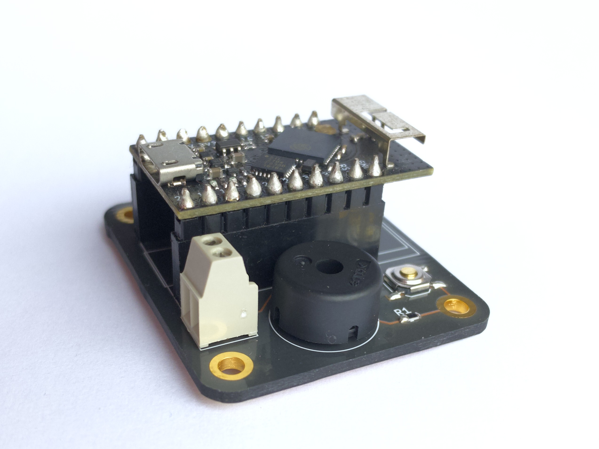
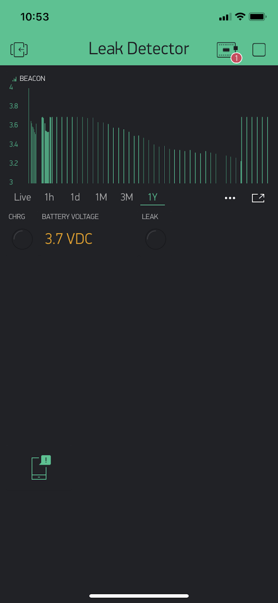

# TinyPICO/ESP32 Leak Detector

Detect leaks, trigger an alarm and send a notification to your phone.

It can be used to save your wood flooring for example as wiping the water off
a couple minutes sooner can make a difference.

The detector gets controlled by a [Blynk](https://blynk.io/) that looks like
this:

## Blynk

In the Blynk app you see a beacon that is sent by the device every week so you
know the device is still alive. The beacon is dual purpose as the data is the
battery voltage capped to 3.7v.

In the screenshot you can see the li-ion battery discharging to full to about
dead in 37 weeks.

Note that this was before changing the battery type and [optimizing](https://github.com/fgervais/leak-detector/commit/07dddd6354a1dfdce8fd6b8dc646baeb9ef110fd)
the touch sensor power consumption. The battery should last much longer now.

Blynk Project | Blynk Project Clone QR
:-------------------------:|:-------------------------:
  |  

The QR code should give you a complete copy of my project if scanned in the
Blynk app.
