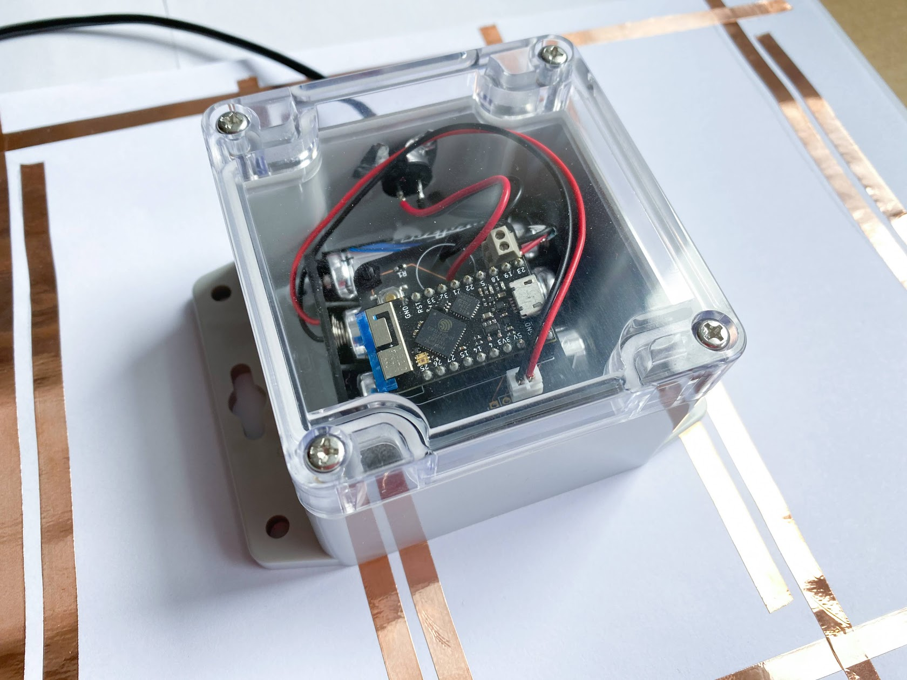

# TinyPICO/ESP32 Leak Detector

Detect leaks, trigger an alarm and send a notification to your phone.

It can be used to save your wood flooring for example as wiping the water off
a couple minutes sooner can make a difference.

## Complete System

## Detection Electrode

To detect a leak, the idea is that water need to bridge the 2 screw terminal
leads.

On my end what I'm doing for this project is using copper tape traces that run
close to each other. Basically the same technique used by some types of user
buttons but bigger.

Those copper traces are on a sheet of paper allowing even a single drop of water
to have quite a wide coverage. This way really little water is required to get
a detection even in the worse case.

## Battery Power

With the first revision of this project, I went with the micropython version
shipped with the TinyPICO and a single 18650 cell. I was aiming to get a
3 years run between recharge but I only got 37 weeks.

Further investigation showed that the majority of the power was used by the
touch detection as the default touch sensor parameters are quite aggressive.

To fix this, I had to expose more of the touch sensor API as shown here:
https://github.com/micropython/micropython/pull/6408. With this I was able to
change the touch sensor polling rate from 37 Hz to about 2 Hz. I also reduced
the time it stays on, looking for a touch.

With these changes in place, the limiting factor for the battery life seemed to
be the self-discharge of the li-ion cell. To mitigate that I changed the 18650
cell by 3 AA Energizer® Ultimate Lithium batteries. These are advertised to
have a really low self discharge and I'm hoping they will perform as so.

## Blynk

The detector gets controlled by a [Blynk](https://blynk.io/) app.

In the Blynk app you see a beacon that is sent by the device every week so you
know the device is still alive. The beacon is dual purpose as the data is the
battery voltage capped to 3.7v.

In the screenshot you can see the li-ion battery discharging to full to about
dead in 37 weeks.

Note that this was before changing the battery type and [optimizing](https://github.com/fgervais/leak-detector/commit/07dddd6354a1dfdce8fd6b8dc646baeb9ef110fd)
the touch sensor power consumption. The battery should last much longer now.

Blynk Project | Blynk Project Clone QR
:-------------------------:|:-------------------------:
  |  

The QR code should give you a complete copy of my project if scanned in the
Blynk app.

# Hardware

The board (rev1) and the BOM are accessible here:

- https://oshpark.com/shared_projects/Uk5klm7L
- https://www.digikey.ca/short/z0c01q
